# Lab 6: Evaluate your GenAI Model using Robust Metrics
---
<div align="center">
    
</div>

## Pendahuluan
Di lab ini, Anda akan berperan sebagai **Prompt Engineer** dan menggunakan watsonx.governance untuk membuat *prompt template*, mengevaluasinya terhadap kumpulan data, dan melihat metrik kinerja. Setelah itu, Anda akan membuka *AI factsheet* dari *prompt* Anda untuk mempelajari cara mengubah ambang batas evaluasi, lalu bereksperimen dengan berbagai varian *prompt template* Anda dan mencoba mencapai evaluasi terbaik yang dapat Anda lakukan pada kumpulan data kami.

## Table of Contents
  1. [Membuat Prompt Template](#creating-a-prompt-template)
     1. [Prompt Variables](#prompt-variables)
     2. [Saving Prompt](#saving-prompt)
     3. [Model Parameters](#model-parameters)
  2. [Mengevaluasi Prompt](#evaluating-your-prompt) 
  3. [Cara Alternatif untuk Melakukan Evaluasi Prompt](#alternative-evaluation)
  4. [Hasil Evaluasi](#evaluation-results)
  5. [Percobaan dengan Prompt Baru](#experimenting-with-new-prompts)
     1. [Memakai Granite](#using-granite)
     2. [Lainnya!](#your-choice)
  6. [Percobaan dengan Seting](#experiment-with-settings)

---
### 1. Membuat Prompt Template<a name="creating-a-prompt-template"></a>
--- 
Mari kita mulai membuat prompt pertama kita. Buka tab "Assets" di beranda proyek. Setelah itu, klik "New Asset".


Pada menu yang muncul, cari kotak bertuliskan "Chat and build prompts with foundation models" untuk membuka *Prompt Lab*. 


Setelah Anda memilih kotak tersebut, Anda akan disambut oleh layar seperti pada gambar di bawah. Halaman tersebut memiliki banyak pilihan untuk mengatur *prompt* sesuai kebutuhan Anda. Anda akan melihat bahwa ada kotak berlabel "Instruction" yang merupakan tempat kita akan meletakkan sebagian besar prompt untuk dievaluasi nanti. Tepat di atasnya, Anda melihat opsi untuk memilih mode "Structured" atau "Freeform". Lab ini akan membahas penggunaan fungsi prompt terstruktur, namun Anda juga dapat melakukannya pada mode *freeform*, jadi pilih opsi mana pun yang paling nyaman bagi Anda! Prompt terstruktur memiliki bagian yang mudah diidentifikasi untuk meletakkan contoh, instruksi, dan variabel *prompt* (yang akan kita bahas nanti). Prompt bentuk bebas memiliki struktur yang lebih longgar dan lebih fleksibel.

Anda juga akan melihat ikon dengan grafik di kanan atas, yang merupakan tombol untuk menjalankan evaluasi yang akan kita bahas nanti. Anda juga akan dapat melihat status pekerjaan Anda di kanan atas, yang menunjukkan apakah pekerjaan sesi prompt Anda Tersimpan atau Tidak Tersimpan. Perhatikan bahwa untuk menjalankan evaluasi, Anda perlu mengeklik menu dropdown dan menyimpan pekerjaan Anda.


Di dalam kotak Instruksi, masukkan *prompt* pertama yang akan kita evaluasi di sepanjang lab ini. Untuk saat ini, masukkan perintah yang ditampilkan di layar di bawah ini.

```
You are an insurance agent tasked to assess insurance claims. Summarize the following insurance claim input. Focus on the car and the damage. Make the summary at least 3 sentences long.
```


Sekarang, kita perlu memastikan bahwa kita dapat menguji *prompt* kita terhadap data validasi dan data pengujian. Untuk melakukannya, kita perlu memastikan bahwa kita telah menyiapkan variabel perintah untuk instruksi kita. Dengan menggulir ke bawah halaman, Anda akan melihat area di layar berjudul "Try". Di dalamnya, Anda harus meletakkan variabel di dalam kotak Input dan memberinya nama "{input}", kemudian klik tombol "Prompt variables".

#### 1.1 Prompt Variables<a name="prompt-variables"></a>
---


Setelah bilah sisi terbuka, Anda akan melihat dua kotak kosong, berlabelkan "Variable" dan "Default Value", yang muncul dan dapat diisi. Masukkan kata "input" ke dalam kotak variabel, dan "null" ke dalam kotak "Default Value".


Di samping tombol *prompt variables*, Anda akan menemukan tombol yang bertuliskan "Model parameters". Kita tidak akan melakukan banyak perubahan untuk saat ini, hanya perkenalan sehingga Anda bisa melakukan modifikasi nanti. Hal terpenting saat ini adalah pada saat pertama kali membuka tab, Anda akan melihat tombol "Greedy" dan "Sampling". Memilih *Greedy* akan memungkinkan hasil model Anda dapat direproduksi di seluruh eksperimen, sementara memilih *Sampling* akan memberi Anda keluaran yang lebih tinggi tinggkat variabilitasnya. Untuk tugas membuat ringkasan saat ini, kita akan memilih opsi Sampling untuk *prompt* dasar kita.

#### 1.2 Model Parameters<a name="model-parameters"></a>
---
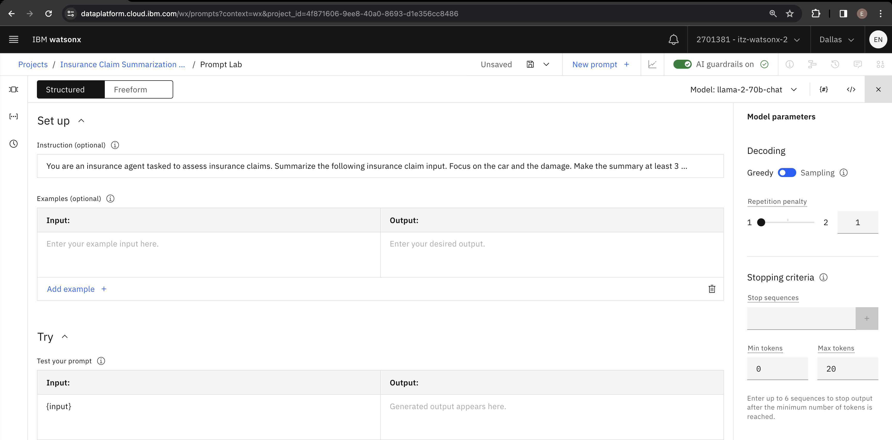

Setelah Anda memilih *Sampling*, Anda akan melihat beberapa opsi baru yang muncul, khusus untuk metode Sampling. Suhu (temperature) merupakan faktor terpenting di sini, di mana pengaturan suhu yang lebih tinggi akan memberikan variasi yang lebih tinggi dan keluaran yang lebih unik. Coba atur parameter ini ke nilai 1 seperti yang saya lakukan pada gambar berikut. Lalu, arahkan kursor ke ikon info untuk mendapatkan informasi lebih lanjut tentang parameter Top P dan Top K.


Gulir ke bawah untuk menemukan parameter *Stopping criteria* dan *Max tokens*. Nilai awal untuk token maksimum adalah 20. Untuk LLM, token tidak selalu sama dengan kata, jadi kita ingin menetapkannya lebih tinggi (misalnya 200) untuk mendapatkan lebih banyak detail pada ringkasan klaim asuransi kita.

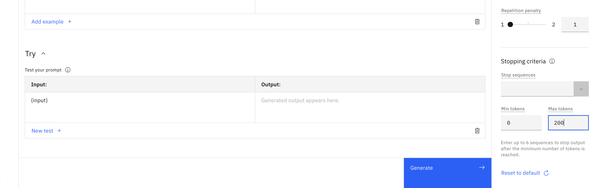

#### 1.3 Saving Prompt<a name="saving-prompt"></a>
---
Setelah semuanya selesai, klik ikon **Save** di bagian kanan atas, lalu klik **Save as**. Ini akan membawa Anda ke layar berikutnya, tempat Anda akan memilih jenis aset, memberi nama *prompt template*, dan memilih klasifikasi dari *prompt* yang dibuat. Pastikan untuk memilih opsi "Prompt template", lalu isi nama dengan cara yang sama seperti yang ditunjukkan pada gambar. Dari sana, pilih **Summarization** sebagai nilai *Task*, dan pastikan untuk memilih **View in project after saving**.


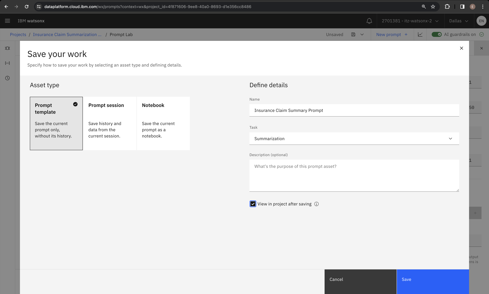

Super! Sekarang Anda seharusnya melihat aset tersebut pada layar saat Anda kembali ke halaman Aset. Pastikan Anda telah menyelesaikan langkah sebelumnya dengan benar dengan mengeklik 3 titik di sebelah kanan aset yang baru terbuat dan pilih **Evaluate**. Kita akan menguji *prompt* baru kita!

### 2. Mengevaluasi Prompt<a name="evaluating-your-prompt"></a>
---


Anda akan melihat layar baru dengan tombol **Evaluate** di bagian tengah layar. Klik tombol tersebut. 

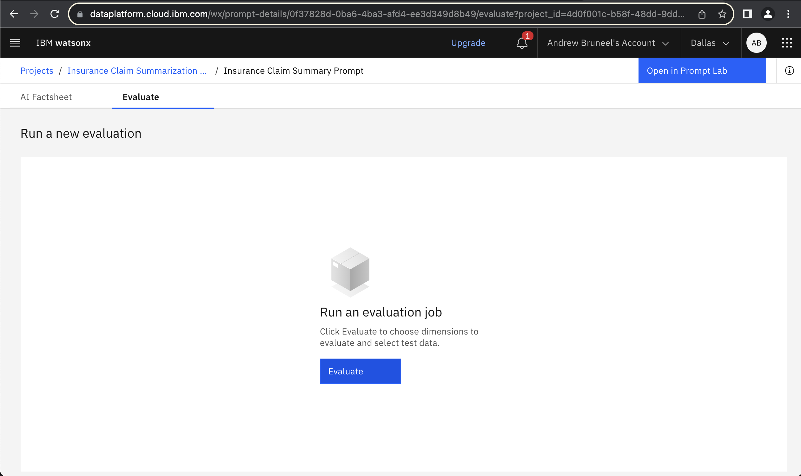

Sekarang Anda akan melihat layar yang menanyakan dimensi apa yang akan dievaluasi. Pada tahap ini, kita hanya dapat mengevaluasi kualitas GenAI (kesehatan model diaktifkan secara default). 


Sekarang, kita akan gunakan kedua data berikut: [summarization validation data](data/Insurance%20claim%20summarization%20validation%20data.csv) dan [summarization test data](data/Insurance%20claim%20summarization%20test%20data.csv) yang ada di dalam folder "data" pada github ini. Untuk sekarang, kita akan gunakan *validation data*. Anda dapat menggunakan *test data* untuk melakukan [Step 6](#experiment-with-settings).


Sekarang saatnya memetakan variabel masukan ke variabel *prompt* yang telah kita buat sebelumnya. Karena kita menggunakan file CSV, kita pilih koma sebagai *delimiter*. Selain itu, kita pilih "input" untuk dipetakan ke kolom "Insurance_Claim" di dalam file CSV. Terakhir, "Reference output" adalah kolom pada dataset yang menyimpan keluaran dari LLM. Ini adalah cara kita mengukur seberapa efektif kita telah menyusun prompt kita.

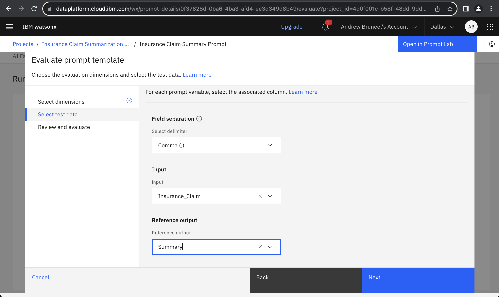

Setelah itu, Anda akan melihat layar untuk meninjau informasi yang telah Anda masukkan. Setelah Anda memverifikasi bahwa Anda telah memasukkan semuanya dengan benar, tekan tombol "Evaluate". dan tunggu hingga proses evaluasi selesai. Proses ini dapat memakan waktu hingga beberapa menit.


Setelah evaluasi selesai, Anda akan melihat layar yang menampilkan hasilnya. Seperti yang dapat Anda lihat di sini, evaluasi kami tidak terlalu berhasil, memicu 13 peringatan dan gagal dalam pengujiannya. Ini sudah diduga! Sasaran lab ini adalah untuk membuat *prompt* pertama, dan berupaya mencapai hasil yang lebih baik sehingga kita dapat menemukan *prompt* yang baik dan akhirnya membawanya ke tahap produksi.


### 3. Cara Alternatif untuk Melakukan Evaluasi Prompt<a name="alternative-evaluation"></a>
---
Bagi yang tertarik, ada cara lain untuk menjalankan evaluasi dari dalam sesi prompt lab. Klik ikon di kanan atas yang seperti grafik, yang merupakan tombol untuk mengevaluasi.

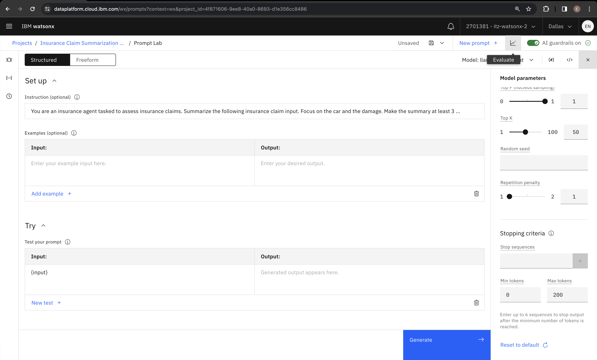

Jika Anda belum melakukannya, Anda akan diminta untuk menyimpan pekerjaan Anda dengan cara yang sama seperti sebelumnya. Kemudian, Anda akan langsung diarahkan ke halaman yang meminta Anda untuk memilih dimensi yang akan dievaluasi, dan melanjutkan dengan proses yang sama seperti [Step 2](#evaluating-your-prompt).


### 4. Hasil Evaluasi<a name="evaluation-results"></a>
---


Gulir ke bawah halaman **Evaluate** untuk melihat metrik spesifik yang digunakan untuk mengevaluasi prompt Anda. LLM dapat dievaluasi menggunakan berbagai metrik, dan metrik yang digunakan bergantung pada tugas yang diminta untuk diselesaikan oleh LLM Anda.

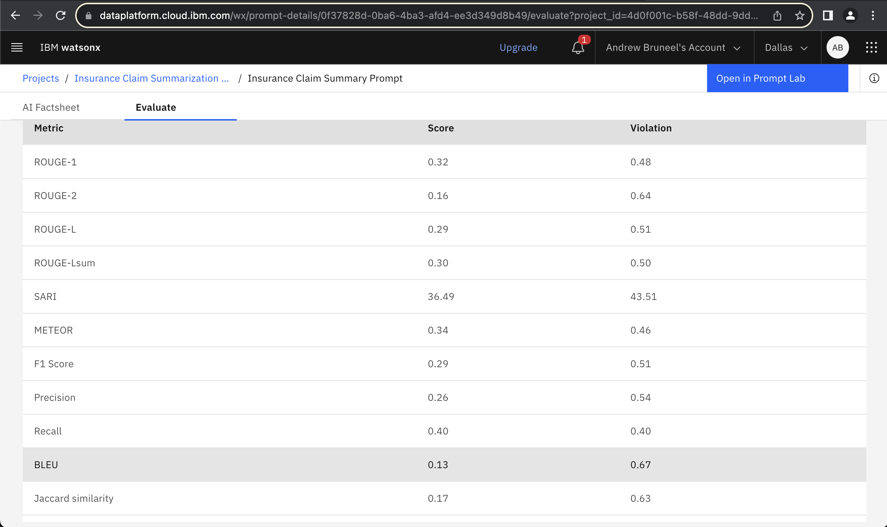

Dalam lab ini, tugas LLM adalah melakukan **Summarization** yang dapat diukur menggunakan berbagai metrik kualitas. Kami menyarankan Anda meluangkan waktu sekarang untuk meninjau dokumentasi tentang [metrik kualitas AI generatif yang didukung oleh watsonx.governance](https://dataplatform.cloud.ibm.com/docs/content/wsj/model/wos-monitor-gen-quality.html?context=wx&audience=wdp#supported-generative-ai-quality-metrics).

[](https://dataplatform.cloud.ibm.com/docs/content/wsj/model/wos-monitor-gen-quality.html?context=wx&audience=wdp#supported-generative-ai-quality-metrics)

Setelah membaca deskripsi metrik evaluasi LLM tersebut, Anda mungkin menyadari bahwa tampilan metrik bawaan pada halaman **Evaluation** tidak terlalu membantu. Jangan khawatir, Anda akan belajar cara mengakses representasi metrik yang lebih intuitif di **AI Factsheet**.

Di sudut kiri atas layar, pilih tab **AI Factsheet**, yang akan menampilkan rincian hasil yang lebih jelas. Hal pertama yang akan Anda lihat di halaman ini adalah pilihan untuk melacak prompt Anda dalam sebuah AI use case. Kami akan membahas opsi ini di lab berikutnya.


Gulir ke bawah halaman ke bagian **Generative AI Quality**, dan Anda akan melihat visual yang mendampingi metrik yang kita lihat sebelumnya. Di sini, Anda bisa melihat seberapa dekat prompt kita dengan standar kelulusan uji. Secara keseluruhan, tampaknya masih banyak yang harus kita kerjakan!


Dengan **AI Factsheet** terbuka, luangkan waktu untuk membaca [metrik kualitas AI generatif yang didukung oleh watsonx.governance](https://dataplatform.cloud.ibm.com/docs/content/wsj/model/wos-monitor-gen-quality.html?context=wx&audience=wdp#supported-generative-ai-quality-metrics). Dengan membandingkan **AI Fact Sheet**, Anda dapat melihat bahwa setiap metrik memiliki batas atas dan batas bawah, dengan rentang ideal ditunjukkan oleh bagian yang lebih tebal di sisi kiri dari setiap pengukuran metrik.

Segitiga terbalik menunjukkan nilai yang diukur untuk setiap metrik. Segitiga hitam menunjukkan hasil baik, sedangkan segitiga merah menunjukkan hasil buruk. Perhatikan baik-baik, dan Anda akan melihat bahwa evaluasi Anda hanya memiliki tiga metrik yang memenuhi standar.


Setiap metrik yang mengukur kualitas ringkasan berada di zona merah. Semoga Anda bisa menghadapi tantangan ini dengan memilih salah satu metrik untuk ditingkatkan dan membangun prompt yang lebih baik untuk kasus meringkas klaim asuransi ini.

Namun, untuk saat ini, saya akan menunjukkan cara memodifikasi ambang batas untuk metrik ini sehingga prompt Anda memiliki persyaratan yang lebih longgar untuk lulus pengujian. Dalam penggunaan dunia nyata, hal ini hanya boleh dilakukan jika benar-benar diperlukan dan sesuai dengan kebutuhan Anda. Kembali ke layar evaluasi, Anda akan melihat tombol biru di sebelah kanan "Generative AI Quality - Text Summarization" di mana kita dapat menyesuaikan ambang batas kita.


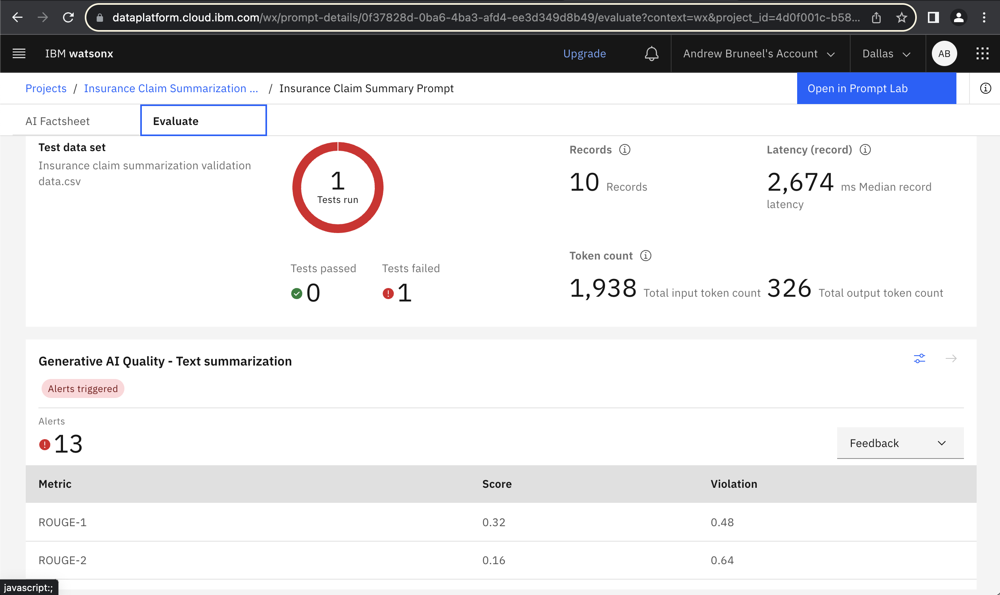

Silakan klik tombol tersebut, dan Anda akan melihat layar berikut:


Di sini, kita akan menyesuaikan metrik keterbacaan (readibility). Metrik ini akan lebih tinggi jika respons yang dihasilkan model terhadap prompt Anda mudah dipahami, dan lebih rendah jika sulit untuk dibaca. Gulir ke bawah halaman dan klik tombol edit untuk memodifikasinya.


Terakhir, silakan ubah keterbacaan sedikit, misalnya menjadi 55, yang menempatkan persyaratan tersebut dalam rentang "Cukup sulit untuk dibaca." Setelah itu, Anda dapat mengklik **save** untuk menyelesaikan perubahan Anda. Sebagai pengingat, metrik ini tidak boleh diubah terlalu banyak dalam penggunaan dunia nyata!


---
#### **Catatan: Seilahkan merujuk ke [powerpoint ini](watsonx.governance-Metrics.pptx) untuk informasi lebih lanjut tentang setiap metrics!
---

### 5. Percobaan dengan Prompt Baru<a name="experimenting-with-new-prompts"></a>
---

Sekarang Anda telah melihat cara membangun template prompt Anda sendiri dan mengevaluasinya terhadap dataset pengujian, saatnya untuk bereksperimen! Tujuan Anda adalah membuat template prompt yang akan lulus tes terhadap dataset validasi yang diberikan kepada Anda di lab. 

Pertama, mari kita mulai dengan membuat dua salinan dari template prompt yang ada yang dapat Anda gunakan untuk dimodifikasi dan dieksplorasi. Klik "Insurance Claim Summarization..." di sudut kiri atas layar Anda, yaitu hyperlink setelah "Projects". Ini akan membawa Anda kembali ke halaman "Assets", yang akan terlihat seperti ini:

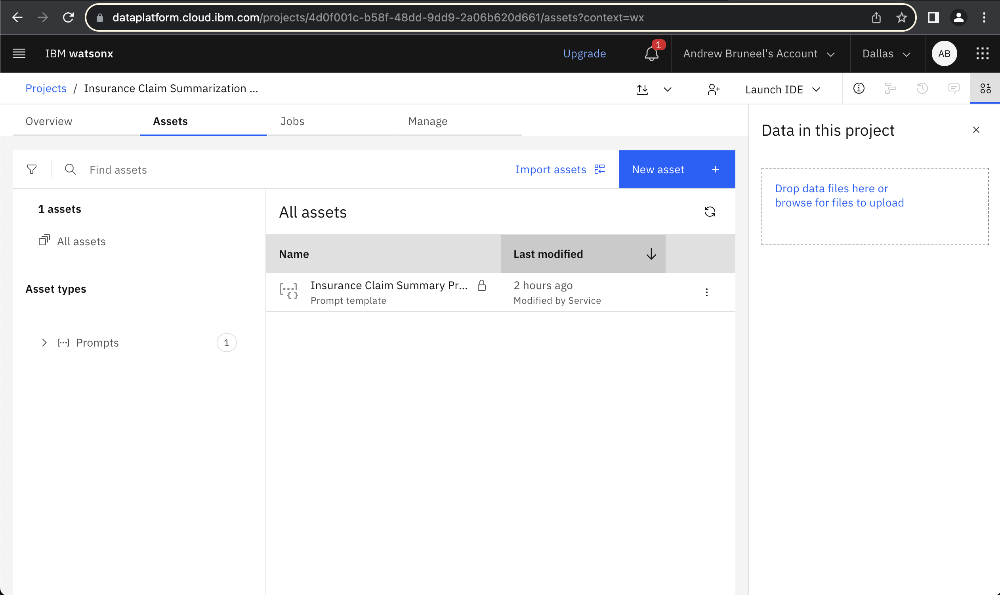

#### 5.1 Memakai Granite<a name="using-granite"></a>
---
Klik kembali ke prompt Anda yang ada, kita akan mengubah LLM yang digunakan untuk menghasilkan ringkasan untuk kita. Setelah Anda melihat layar prompt kembali, matikan pengaturan "Autosave" di bagian header halaman. Kemudian, klik dropdown pemilihan model dan pilih "View all foundational models".

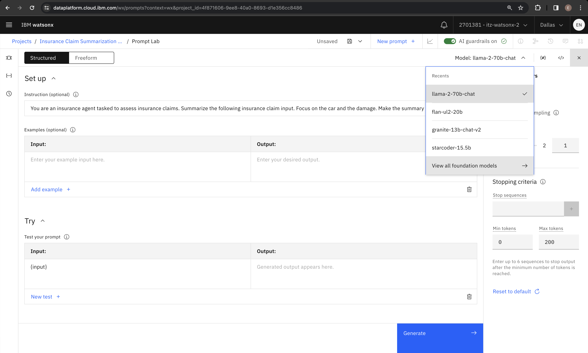

Pilih IBM's granite-13b-chat-v2 sebagai model untuk prompt pembuat ringkasan ini.

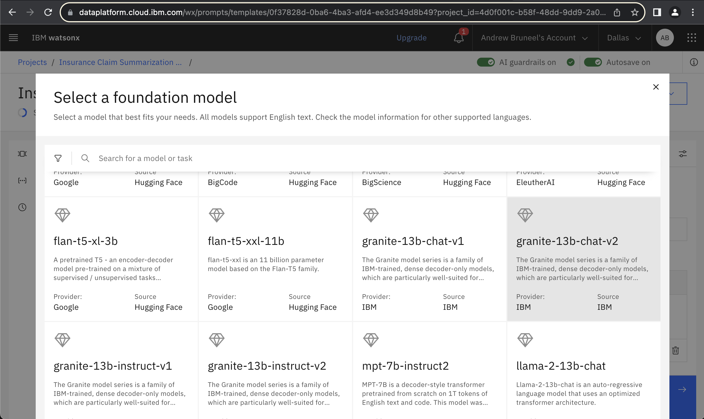

Anda akan melihat halaman muncul yang menampilkan informasi berguna tentang model yang tersedia, serta tombol biru "Select Model". Silakan klik tombol tersebut setelah Anda siap.

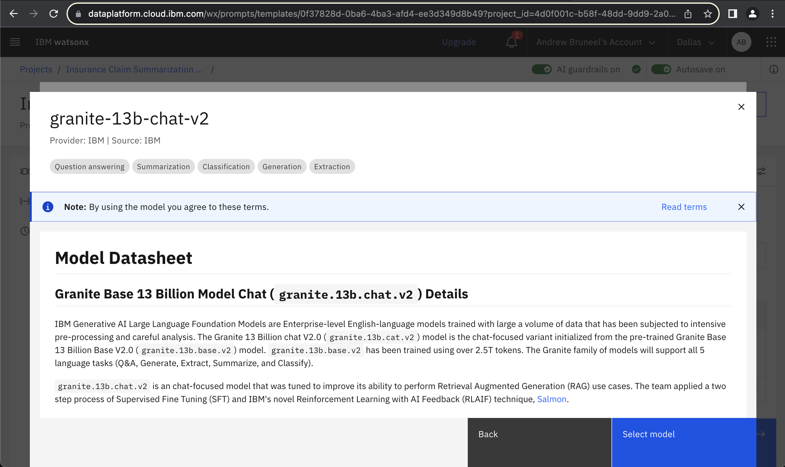

Dari sini, kita akan menggunakan opsi "Save as" sekali lagi, yang akan membuat sebuah instance baru dari template prompt di halaman aset kita.


Isi informasi di halaman "Save Your Work" seperti yang saya contohkan di bawah ini. Pastikan untuk memasukkan nama model Anda di dalam kolom "Name", karena ini akan penting saat kita membuat template prompt berikutnya!


kerja bagus -- sekarang kita seharusnya bisa melihat template baru di dalam halaman Project, sekaligus dengan template asli yang kita buat sebelumnya.


#### 5.2 Cara Lainnya!<a name="your-choice"></a>
---
Sekarang setelah Anda melihat betapa cepatnya membuat salinan dari template prompt asli Anda, Anda dapat membuat template baru ke model yang Anda pilih! Ulangi langkah yang Anda lakukan untuk membuat template prompt yang dievaluasi dengan granite, tetapi kali ini pilih model baru (Pastikan untuk mengklik ke **template asli** yang kami buat, bukan template granite). Model tersebut bisa apa saja yang Anda inginkan! Pastikan untuk **menyertakan nama model** dalam penamaan template prompt baru Anda, seperti yang kita lakukan dengan granite. Ini akan membantu Anda dengan cepat membedakan antara template prompt di kemudian hari. Berikut adalah tab Aset saya setelah saya menambahkan satu model lagi:


### 6. Percobaan dengan Seting<a name="experiment-with-settings"></a>
---
Sekarang setelah Anda mencapai tahap ini, Anda siap untuk bereksperimen dan meningkatkan kinerja prompt Anda! Tujuannya adalah agar Anda dapat lulus evaluasi terhadap data validasi menggunakan alat yang tersedia untuk Anda. Silakan melakukan perubahan sebanyak yang Anda mau, termasuk:

* Membuat template prompt baru dengan model yang berbeda
* Mengubah instruksi prompt
* Menyediakan contoh (few-shot prompting)
* Mengubah parameter model seperti:
  * Greedy vs. Sampling
  * Temperature
  * Min/Max Tokens
  * Top P/Top K
  * Stop Sequence
* Mengevaluasi template prompt menggunakan dataset yang berbeda

Dan perubahan lain yang Anda pikirkan! Mungkin juga berguna sebagai langkah awal bagi Anda untuk melihat lebih dekat pada data validasi. Dari sana, Anda dapat memutuskan modifikasi mana yang akan difokuskan yang menurut Anda akan paling efektif dalam meningkatkan hasil Anda. Pastikan untuk merujuk pada langkah-langkah sebelumnya dari lab jika Anda memiliki pertanyaan; langkah-langkah tersebut seharusnya dapat menjawab sebagian besar pertanyaan yang Anda miliki!

---
#### **Catatan: Ingat bahwa jika Anda mengalami kesulitan, Anda dapat memodifikasi ambang batas untuk evaluasi Anda **jika diperlukan**. Beberapa ambang batas memiliki nilai default yang tinggi dan sulit dicapai bahkan oleh model-model mutakhir, jadi jika Anda mendapati diri Anda terus-menerus berada jauh di bawah nilai ambang batas meskipun telah mencoba solusi di atas, pertimbangkan untuk memodifikasi nilai ambang batas Anda. PowerPoint yang dibagikan dalam sumber daya lab ini adalah sumber yang baik untuk melihat metrik mana yang mungkin berguna untuk menurunkan ambang batas.
---

Contoh few-shot prompting:

Di bawah ini adalah contoh singkat tentang penggunaan few-shot prompting dalam konteks data yang digunakan untuk lab ini. Pastikan bahwa saat Anda memutuskan untuk menggunakan few-shot prompting, Anda menggunakan contoh yang **berbeda** dari apa yang ada di data validasi dan pengujian Anda. Jika tidak, Anda akan melatih model Anda pada skenario yang tepat yang akan dilihat dalam data pengujian, yang bukanlah skenario realistis yang akan Anda temui dalam penggunaan dunia nyata! Contoh ini menunjukkan satu shot, tetapi silakan tambahkan lebih banyak untuk membuat model Anda lebih terfokus pada contoh yang Anda berikan!


Saat Anda terus melakukan perubahan, prompt juara Anda dengan kinerja terbaik akan dipilih untuk digunakan di lab berikutnya!

<div align="center">
    
</div>
